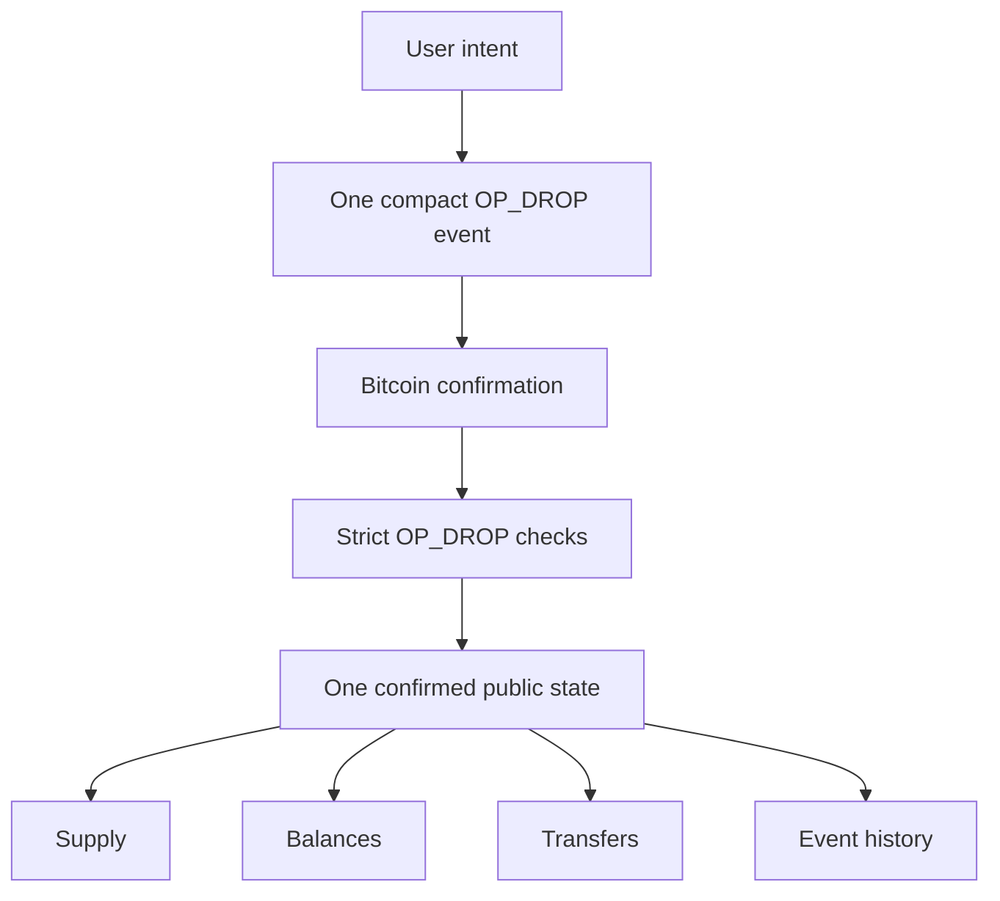
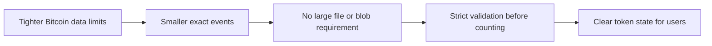
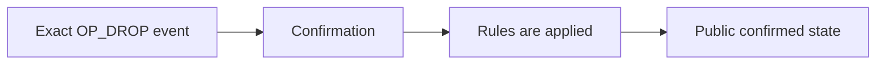
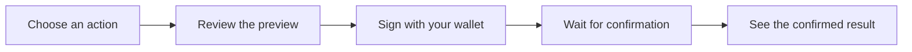

# OP_DROP

  <strong>Rules for OP_DROP token activity.</strong> 
  Deploy, mint, transfer, and inspect the confirmed result.

## How OP_DROP records token activity

OP_DROP does not treat a generic inscription or token-looking transaction as a
balance. It records a compact, exact event, then applies its supply, mint,
transfer, and settlement rules after confirmation.

### Core rules

| Rule | Result |
| --- | --- |
| **Exact event, not a loose label** | The app reads one defined action, not just text that happens to look like a token. |
| **Confirmed state, not inference** | Supply and balances change only after confirmation and validation. |
| **Transfers have a visible lifecycle** | Units are available, then reserved, then settled or returned. |
| **One deterministic record** | Explorer and Portfolio follow the same chain order and public rules. |

## Working within tighter Bitcoin data limits

OP_DROP uses compact events and a narrow transaction profile so it can operate
in a Bitcoin environment with tighter limits on arbitrary data. This is an
application design choice, not a prediction about Bitcoin consensus or a
replacement for other protocols.

Read [BIP-110 and OP_DROP](docs/guides/bip110-compatibility.md) for the actual
limits and how the protocol operates within them. Read [Why OP_DROP](docs/why-op-drop.md)
for the complete design story.

## Key properties

| Property | Result |
| --- | --- |
| **Confirmed, not assumed** | A balance changes only after the action confirms and passes the OP_DROP rules. |
| **Compact by design** | OP_DROP uses a short, exact event instead of requiring a large arbitrary data payload. |
| **Transfers stay visible** | Units move from available to reserved, then settle at the destination or return if settlement is invalid. |
| **One public rulebook** | Supply, holders, events, and balances follow the same deterministic rules in Explorer and Portfolio. |

OP_DROP uses compact event data and strict checks. See
[BIP-110 and OP_DROP](docs/guides/bip110-compatibility.md) for the relevant
limits and the meaning of the BIP-110 READY badge.

## What is OP_DROP?

OP_DROP is a token system inside this application. It lets you:

- **Deploy** a new token and set its supply rules.
- **Mint** units of a token after it has been deployed.
- **Transfer** units to another address.
- **Verify** what has actually confirmed, instead of guessing from a pending
  transaction or wallet preview.

OP_DROP is separate from BRC-20 and Ordinals. A BRC-20 or Ordinals balance is
not automatically an OP_DROP balance.

## Actions in OP_DROP

OP_DROP lets you create a token, mint units under its rules, transfer confirmed
units, and inspect the public confirmed result without confusing a preview or
pending transaction with a balance.

## How it works

1. Open the dedicated **OP_DROP** workspace.
2. Choose **Deploy**, **Mint**, or **Transfer**.
3. Review the exact details before you sign.
4. Wait for the transaction to confirm.
5. Check **Explorer** for the confirmed event record or **Portfolio** for an address
   balance.

## The three actions

| Action | Simple explanation | What happens after confirmation |
| --- | --- | --- |
| **Deploy** | Create a token's rules, including its maximum supply and mint limit. | The first valid deployment for that ticker becomes the active one. |
| **Mint** | Claim units under an existing token's rules. | Valid units appear in the confirmed balance for the event's address. |
| **Transfer** | Send confirmed available units onward. | Units become reserved first, then appear at the destination when the transfer completes. |

## Start with the page that matches your goal

| I want to... | Start here |
| --- | --- |
| Make my first OP_DROP action | [Get started](docs/guides/getting-started.md) |
| Check a token, event, or address | [Explorer and Portfolio](docs/guides/op-drop-explorer.md) |
| Understand why a balance or event is shown | [Indexing rules](docs/indexing-rules.md) |
| Read the exact event format | [Event rules](docs/protocols/op-drop-json.md) |
| Read the protocol design and scope | [OP_DROP design](docs/why-op-drop.md) |

## `$DROP` in one minute

`$DROP` is the display name for the OP_DROP ticker `drop`.

| Term | Value |
| --- | ---: |
| Maximum supply | 21,000,000 whole units |
| Maximum valid mint | 1,000 units per mint event |
| Decimal places | None |

The `$DROP` terms apply only once its deployment has confirmed and appears in
the OP_DROP confirmed view.

## What OP_DROP does not promise

OP_DROP cannot promise that a transaction will relay, mine, or confirm at a
particular time. It also cannot make another wallet, marketplace, miner, or
indexer use the same rules. For this app, rely on the confirmed state shown in
Explorer and Portfolio, not on a draft or pending transaction.
