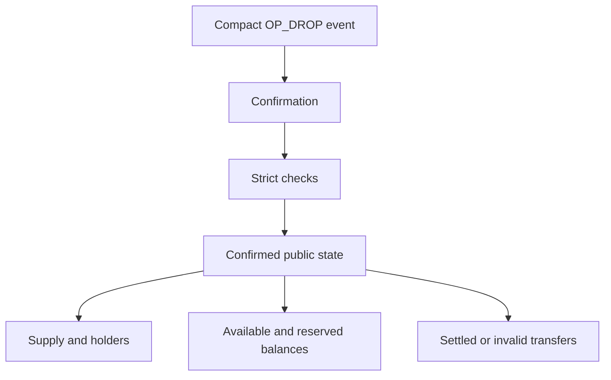
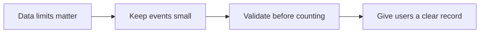
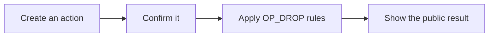
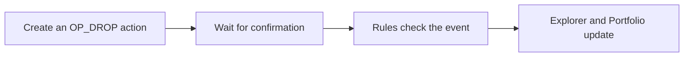

# OP_DROP documentation

> **Bitcoin tokens are entering their next phase.** OP_DROP is a focused,
> Bitcoin-native protocol for compact events, deterministic rules, and confirmed
> state that users and builders can inspect together.

## Start with the promise

OP_DROP changes the experience from "something that looks like a token event"
to "a defined event that the transaction and the rules prove." Every action is
previewed, confirmed, checked, and exposed through one public state model.

### Highlights for users

- **See exactly what you sign:** the compact event is readable before approval.
- **Know what counts:** pending activity never appears as a confirmed balance.
- **Follow the lifecycle:** transfers show available, reserved, settled, or
  returned units.
- **Use one source of truth:** Explorer and Portfolio follow the same confirmed
  OP_DROP record.

### Highlights for builders

- **Integrate a contract, not folklore:** canonical event text and decision rules
  are documented.
- **Build Bitcoin-native tools:** wallets, explorers, marketplaces, and indexers
  can work from the same confirmed state model.
- **Keep the protocol legible:** compact events reduce ambiguity and make testing
  practical.

## What is changing in Bitcoin inscriptions

| Ecosystem habit | OP_DROP approach |
| --- | --- |
| Tickers and payloads are interpreted by convention. | Exact events define identity and intent. |
| Pending activity is easy to mistake for ownership. | Confirmation is a hard boundary for accounting. |
| Transfer state is often invisible between sender and receiver. | Reservation and settlement are explicit. |
| Protocol names and carrier details become conflated. | User protocol identity remains separate from technical construction details. |

**The future belongs to Bitcoin token protocols that can be read by a person,
validated by software, and settled by the chain. OP_DROP is an invitation to help
build that future now.**

## How OP_DROP records token activity

OP_DROP uses one compact, exact event and turns it into confirmed public state.
It does not assume a generic inscription or token-looking transaction is
already a balance.

## Working within tighter Bitcoin data limits

OP_DROP uses compact events, strict validation, and confirmed accounting rather
than large arbitrary data payloads. This is an application design choice. It
does not state that a consensus proposal is active or replace other protocols.

Read [OP_DROP design](why-op-drop.md) for the protocol design and
[BIP-110 and OP_DROP](guides/bip110-compatibility.md) for the limits behind
this approach.

## Key properties

| Property | Result |
| --- | --- |
| **Confirmed balances** | Pending actions never appear as confirmed OP_DROP balances. |
| **Compact events** | Every action is a small, exact event you can review before signing. |
| **Visible transfer state** | You can see whether units are available, reserved, settled, or returned. |
| **Compact event format** | OP_DROP uses small, exact events and strict checks. |

Read [BIP-110 and OP_DROP](guides/bip110-compatibility.md) for the actual
limits and how OP_DROP operates within them.

## Start here if you are new

OP_DROP is a way to create and track token activity in this app. Only confirmed
activity changes the OP_DROP record.

You can use OP_DROP to create a token, mint units, transfer units, and inspect
the confirmed result. Explorer shows confirmed events. Portfolio shows the
confirmed balance for an address.

The protocol uses small exact events, strict checks, and confirmed accounting
rather than large arbitrary data payloads. Read
[BIP-110 and OP_DROP](guides/bip110-compatibility.md) for the constraints that
matter here.

## Pick what you need

| If you are trying to... | Read this |
| --- | --- |
| Create a token, mint, or transfer for the first time | [Get started](guides/getting-started.md) |
| See what a token or address actually has | [Explorer and Portfolio](guides/op-drop-explorer.md) |
| Understand available, reserved, confirmed, pending, or invalid | [Indexing rules](indexing-rules.md) |
| Check the exact data you are signing | [OP_DROP event rules](protocols/op-drop-json.md) |
| Understand the BIP-110 READY badge | [BIP-110 READY](guides/bip110-compatibility.md) |
| Read the protocol design and scope | [OP_DROP design](why-op-drop.md) |
| Publish a launch or community message | [Messaging kit](messaging-kit.md) |
| Integrate OP_DROP into a product | [Integration checklist](integration-checklist.md) |
| Contribute a rule, guide, or integration | [Contributing](../CONTRIBUTING.md) |

## The words you will see

| Word | What it means |
| --- | --- |
| **Confirmed** | The event is in the confirmed OP_DROP record and can affect supply or balances. |
| **Pending** | The action is not confirmed yet. It does not affect a balance. |
| **Available** | Confirmed units you can use in a new transfer. |
| **Reserved** | Confirmed units that are waiting for a transfer to finish. |
| **Invalid** | An observed event that did not pass a required rule, so it does not affect balances. |

## `$DROP` basics

`$DROP` uses the ticker `drop`. Its planned maximum supply is 21,000,000 whole
units and each valid mint event can request up to 1,000 units. These rules take
effect only after the deployment is confirmed.

## Keep this in mind

- OP_DROP is separate from BRC-20 and Ordinals.
- A wallet preview or pending transaction is not a confirmed balance.
- A transfer can be reserved before it is completed at its destination.
- Explorer and Portfolio show this app's confirmed OP_DROP view.
