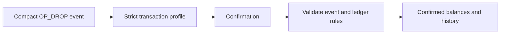

# BIP-110 and OP_DROP

> **Build for the future, describe the present accurately.** OP_DROP uses a
> compact, narrow, BIP-110-aware transaction profile to give Bitcoin token
> builders a focused design. The profile is an application choice. It is not a
> claim that BIP-110 is active or that every Bitcoin service will recognize it.

<p align="center">
  BIP-110 limits, the OP_DROP transaction profile, and the BIP-110 READY badge.
</p>

## What is BIP-110?

[BIP-110](https://bips.dev/110/) is a published Bitcoin proposal called
"Reduced Data Temporary Softfork." It is marked `Complete` as a specification,
but that does **not** mean it is active on Bitcoin.

The proposal describes temporary consensus limits intended to reduce large or
ambiguous data use. OP_DROP uses compact events and a narrow transaction
profile so it can work under those constraints.

## The limits in plain English

If the proposed BIP-110 rules were active, new transactions during its temporary
deployment would face these limits:

| BIP-110 limit | Plain-English meaning | How OP_DROP responds |
| --- | --- | --- |
| Standard new outputs are at most 34 bytes, except limited `OP_RETURN` outputs | The long-term on-chain destination cannot carry a large data payload. | OP_DROP uses a compact native Taproot commitment output. |
| Data pushes and witness arguments are at most 256 bytes | One event cannot be an oversized blob of arbitrary data. | OP_DROP uses one short, canonical JSON event. |
| Undefined witness and Tapleaf versions cannot be spent | The protocol cannot rely on undefined upgrade paths. | OP_DROP stays within the defined, supported transaction profile. |
| No Taproot annex | Extra annex data is not available. | OP_DROP does not use an annex. |
| Taproot control blocks are at most 257 bytes | Deep or oversized script trees are constrained. | OP_DROP uses a shallow, single-leaf profile. |
| No `OP_SUCCESS*` opcodes | Future-success shortcuts are unavailable. | OP_DROP does not use them. |
| No executed `OP_IF` or `OP_NOTIF` | Conditional Tapscript branches are constrained. | OP_DROP avoids conditional branches in its strict profile. |

These are limits, not features that OP_DROP can activate. Only Bitcoin consensus
rules decide whether BIP-110 is active.

## How OP_DROP works within those limits

The important change is discipline at the carrier layer: keep the event small,
keep the transaction profile explicit, and validate before counting. This gives
users a clearer signing experience and gives builders a stable target while the
Bitcoin inscription ecosystem continues to evolve.

Each OP_DROP action is one exact event with defined meaning.



### 1. One compact event

Each action is a short JSON document. It says exactly what happened:

```json
{"p":"op-drop","op":"mint","tick":"drop","amt":"1000"}
```

The event is intentionally small, uses fixed field order, and does not depend
on a large file, image, or arbitrary data payload. See the
[event rules](../protocols/op-drop-json.md) for the exact format.

### 2. A strict, predictable profile

OP_DROP applies a narrow transaction profile before it counts an event. In user
terms, that means the app does not simply look for text that resembles a token
action. It checks that the event is carried in the expected form and that the
transaction fits the OP_DROP rules.

### 3. Confirmed state, not just visible data

After confirmation, OP_DROP applies deterministic deployment, mint, supply,
and transfer rules. That is why Explorer and Portfolio can distinguish:

- a pending action from a confirmed balance;
- a valid mint from an over-limit mint;
- available units from units reserved during transfer; and
- a completed transfer from one that must return to the sender.

Read the [indexing rules](../indexing-rules.md) for the complete public
decision process.

## Implications for token users

Ordinals and BRC-20-style activity can be useful reference points, but they do
not automatically tell the OP_DROP app what a confirmed OP_DROP balance is.
OP_DROP provides a confirmation-first approach for users who need:

| Need | OP_DROP behavior |
| --- | --- |
| Know whether activity is final enough to count | Confirmed-only state. |
| Know how token supply is calculated | First valid deployment, fixed supply terms, and deterministic mint rules. |
| Know where units are during a transfer | Separate available and reserved balances until settlement. |
| Understand a rejected action | Visible invalid status and reason without changing balances. |

OP_DROP is one way to record token-like activity on Bitcoin. It uses compact
events, strict rules, and one confirmed state view.

## What the BIP-110 READY badge means

When the OP_DROP workspace shows **BIP-110 READY**, it means the app is using
its OP_DROP strict profile and checking it before confirmed activity is shown.

It does **not** mean:

- BIP-110 is active on Bitcoin;
- Bitcoin will relay or mine a transaction;
- a transaction is guaranteed to confirm by a particular time;
- another wallet, marketplace, miner, or indexer will use OP_DROP rules; or
- OP_DROP overrides Bitcoin consensus rules.

## A practical user checklist

Before relying on an OP_DROP action:

1. Use the dedicated OP_DROP workspace.
2. Review the exact preview before signing.
3. Treat the action as pending until Explorer or Portfolio shows confirmed
   state.
4. Check the event status and reason if an expected balance does not appear.
5. Do not substitute an Ordinals or BRC-20 result for the OP_DROP confirmed
   view.

For the official wording and full consensus specification, read
[BIP-110](https://bips.dev/110/).
