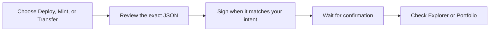

# Get started with OP_DROP

You do not need protocol knowledge to use OP_DROP. Think of it this way:

- **Deploy** means setting the rules for a new token.
- **Mint** means receiving units under rules that already exist.
- **Transfer** means moving confirmed units to someone else.

This guide explains the dedicated OP_DROP workspace and what must happen before
an action appears in Explorer or Portfolio.

> **Use the dedicated op-drop workspace.** It is separate from BRC-20. A
> normal BRC-20 action does not become `op-drop` unless it is created in the
> op-drop workspace.

## From action to confirmed state



## Before you begin

- Use a wallet and network supported by the application.
- Keep enough BTC for the single total shown at checkout and for ordinary
  wallet requirements.
- Read the exact JSON preview before signing. `p` must be `op-drop`.
- Treat every order as pending until it is confirmed and shown in Explorer or
  Portfolio.

### Two ideas to remember

| Idea | In plain English |
| --- | --- |
| A ticker | The short identifier for a token, such as `drop`. |
| Confirmation | The point at which the action can affect the OP_DROP record. Before that, it is only pending. |

## Choose your OP_DROP action

| Operation | What it does | Required JSON fields |
| --- | --- | --- |
| Deploy | Establishes the first valid rules for a new four-character ticker. | `tick`, `max`, `lim` |
| Mint | Requests units under an existing valid deployment. | `tick`, `amt` |
| Transfer | Reserves available units until the transfer completes. | `tick`, `amt` |

Each operation has one compact JSON preview. Do not add whitespace, change key
order, or substitute a different protocol marker.

## Read BIP-110 READY correctly

In the dedicated op-drop workspace, the **BIP-110 READY** badge means the app
checks the selected op-drop flow before confirmed activity is shown.

There is no selectable BIP-110 checkbox inside the `op-drop` route. This is an
application-level enforcement choice. It does not activate
[BIP-110](https://bips.dev/110/), guarantee relay or mining, or make another
wallet or indexer recognize the event. Read
[compatibility and scope](bip110-compatibility.md) before relying on the label.

## Deploy a token

1. Select **Deploy** in `op-drop`.
2. Choose a four-character lowercase ticker and positive integer `max` and
   `lim` values. `lim` cannot exceed `max`.
3. Check the preview. Deploy keys are always ordered as `p`, `op`, `tick`,
   `max`, `lim`.

   ```json
   {"p":"op-drop","op":"deploy","tick":"demo","max":"21000000","lim":"1000"}
   ```

4. Check Explore for the ticker before signing. Tickers are not reserved. The
   first valid confirmed deployment wins.
5. After confirmation, record the deployment event ID and reveal transaction
   ID. Those are stronger identifiers than a display ticker alone.

## Mint `$DROP`

`$DROP` uses wire ticker `drop`, maximum supply `21,000,000`, and a per-event
mint limit of `1,000` units.

```json
{"p":"op-drop","op":"mint","tick":"drop","amt":"1000"}
```

The dedicated UI allows at most five separate `op-drop` mint events in one
batch. That does not change the per-event `$DROP` limit. Smaller valid mints
are allowed by the general ledger rules, so `21,000` is the count of full-limit
mints, not a promise that every launch uses exactly that number of events.

The checkout screen intentionally shows the total payable cost. It does not
publish an internal fee breakdown.

## Transfer OP_DROP units

1. Select **Transfer** and enter an amount no larger than your confirmed,
   available `op-drop` balance.
2. Verify the preview, for example:

   ```json
   {"p":"op-drop","op":"transfer","tick":"drop","amt":"1000"}
   ```

3. After the transfer event is confirmed, the amount is reserved.
4. When the transfer completes and confirms, Explorer shows it at the
   destination. Until then, the amount remains reserved, not available.

## Read the result

| You see | It means |
| --- | --- |
| Pending order | The application is waiting for a transaction step or confirmation. It is not a balance. |
| Indexer warming up | The confirmed view is still catching up. Recheck later. |
| Confirmed event | The event passed the op-drop rules and affects confirmed state. |
| Invalid event | The transaction was observed but does not affect balances. Read its indexed reason. |
| Reserved transfer | A transfer is confirmed but has not completed yet. |

Use [Explorer and Portfolio](op-drop-explorer.md) for confirmed state and the
[op-drop event rules](../protocols/op-drop-json.md) for the exact JSON format.
