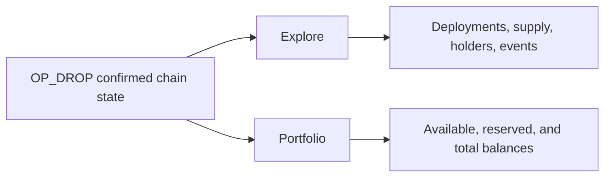

# OP_DROP Explorer and Portfolio

> **The explorer is where the future becomes visible.** OP_DROP turns raw
> Bitcoin activity into a readable confirmation-first record, so users can see
> what settled, communities can follow a launch, and builders can prove what
> their tools are showing.

Explorer and Portfolio are the app's read-only view of confirmed OP_DROP state.
They show confirmed results, not an estimate, a pending order, or a generic
BRC-20 balance.

A wallet can show that you signed or submitted something. Explorer and
Portfolio show what has become confirmed OP_DROP state.

Explorer reports confirmed `op-drop` activity. Another wallet, marketplace,
miner, or indexer can use different rules or display a different result.

## The user-facing change

OP_DROP is designed to make the evidence path obvious:

```text
exact event -> Bitcoin confirmation -> rule validation -> public state
```

That means a pending action is not presented as a balance, a reserved transfer
is not hidden, and an invalid event can be explained instead of silently ignored.
This clarity is how new users can come on board quickly without being asked to
trust what they cannot inspect.

## The two ways to read OP_DROP



## What Explorer and Portfolio show

### Explore

Open **Explore** and select **op-drop**. The explorer desk provides:

- `$DROP` terms and the canonical `drop` ticker;
- deployment state, mint progress, holder count, and recent confirmed events;
- confirmation progress and clear empty, loading, partial, and retry states.

An empty list is normal before a valid deployment reaches the configured
confirmation depth. It does not establish that a token exists or that a
pending transaction will become valid.

### Portfolio

Open **Portfolio**, or search an address from **Explore**. The `op-drop` card
is separate from Ordinals and BRC-20 sections.

| Field | Meaning |
| --- | --- |
| Available | Confirmed `op-drop` units currently usable by the address. |
| Reserved | Units held by a valid, unsettled transfer anchor. |
| Total | Available plus reserved `op-drop` units. |

Recent events show confirmed state. A generic inscription, pending reveal, or
balance from another indexer is not evidence of an `op-drop` balance.

## Read the state correctly

| State | What it means |
| --- | --- |
| No token found | No confirmed valid `op-drop` deployment for that ticker on this indexer network. |
| Indexer warming up | The confirmed view is still catching up. Recheck later. |
| Reserved | A valid transfer is waiting to complete. |
| Invalid event | The transaction was seen but does not credit a balance. |
| Partial data | Some confirmed information is still loading. Recheck later. |

## Scope

Explorer is deliberately read-only. It makes no claim that other wallets,
marketplaces, miners, or indexers will recognize an `op-drop` event. For exact
event rules, read the [op-drop JSON specification](../protocols/op-drop-json.md).
