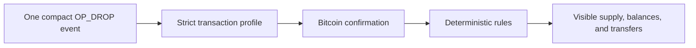
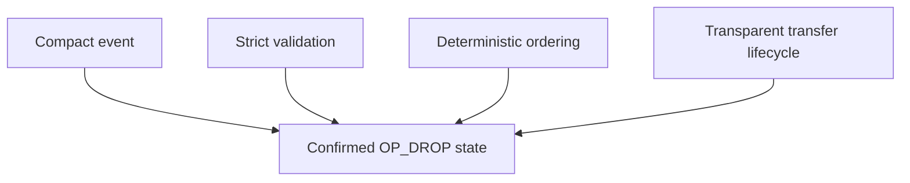
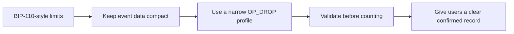
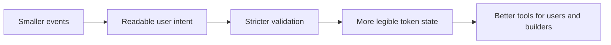

# OP_DROP design

  <strong>Bitcoin-native tokens need primitives people can verify.</strong> 
  OP_DROP uses compact events and deterministic rules to derive confirmed token state.

> **A protocol for the next chapter of Bitcoin inscriptions:** OP_DROP is a bet
> on smaller, clearer, confirmation-first token events. It does not ask users to
> trust a ticker, a screenshot, or an opaque indexer. It gives them an exact
> action, a Bitcoin transaction, and a public rulebook.

This document explains the protocol's design choices and scope.

## The future we are building

Bitcoin has the strongest settlement story in the ecosystem. The opportunity
now is to make token activity worthy of that foundation: compact enough to
inspect, strict enough to implement consistently, and clear enough for a new
user to understand before signing.

### What is changing

- From loose inscription conventions to an explicit application contract.
- From "pending looks like ownership" to confirmation-first accounting.
- From hidden transfer transitions to visible reservation and settlement.
- From indexer-specific guesses to published rules and reproducible state.
- From protocol name confusion to a deliberate boundary around OP_DROP.

### Why builders and users should join now

The protocol layer is still being shaped. Early users can set a higher standard
for previews and confirmed state. Early creators can publish rules their
communities can inspect. Early builders can make wallets, explorers, and indexers
agree on the same event model before incompatible habits harden.

**Come on board fast by doing something concrete: read the event rules, test the
flow, integrate the confirmed state, or bring a community that wants Bitcoin
tokens with clearer evidence.**

## Protocol flow

OP_DROP does not treat every token-looking transaction as a balance. It records
an exact event and applies a defined set of rules after confirmation.

| Question | OP_DROP behavior |
| --- | --- |
| I signed something. Did it count? | Only confirmed, rule-valid events change the OP_DROP record. |
| Where did my transfer go? | Units are shown as available, reserved, or settled. |
| Which deployment is active? | The first valid confirmed deployment for a ticker establishes the rules. |
| Why did this not work? | Invalid events can be displayed with a reason, without changing balances. |

## Core design decisions

### Compact events

An OP_DROP action is a short, exact event, not a large arbitrary payload. The
small format makes the user intent readable and helps the protocol fit a
Bitcoin environment with tighter data limits.

### Validation before accounting

The app does not award a balance because text resembles a token action. It
checks the event, the transaction profile, confirmation, and the relevant
ledger rule before confirmed state changes.

### Deterministic ordering

Deployments, mints, and transfers are applied in deterministic blockchain
order. That gives Explorer and Portfolio one coherent answer for supply,
holders, balances, and event history.

### Transfer lifecycle

A transfer does not instantly disappear from the sender and magically appear
at the recipient. OP_DROP shows the intermediate reserved state, then either
settles the units at the destination or returns them if settlement is invalid.

## BIP-110 compatibility

Bitcoin proposals such as BIP-110 focus on reducing oversized or ambiguous data
patterns. OP_DROP uses compact events, a limited transaction profile, no large
data requirement, and a ledger derived from confirmed events.

This is not a claim that BIP-110 is active or that OP_DROP can activate it.
It is a design choice: make OP_DROP useful in a Bitcoin environment that values
small, well-defined activity. Read [BIP-110 and OP_DROP](guides/bip110-compatibility.md)
for the actual limits and scope.

## Relationship to Ordinals and BRC-20

OP_DROP is not an Ordinals or BRC-20 clone. It provides a separate confirmed
record for token-like activity on Bitcoin.

| Instead of relying on... | OP_DROP focuses on... |
| --- | --- |
| A generic inscription or a token-looking transaction | An exact OP_DROP event with explicit rules. |
| A balance inferred from a different protocol | Its own confirmed supply and balance record. |
| A transfer with an unclear in-between state | Available, reserved, and settled units. |
| A user guessing whether an event counted | A visible confirmed or invalid outcome. |

## Scope

The design favors token activity that is easier to inspect and less likely to
be misunderstood:

This is an application design choice, not a prediction about Bitcoin consensus,
market adoption, or support by other services. Within this app, the confirmed
view follows the rules published in this repository.

## Related documentation

| Next step | What you will learn |
| --- | --- |
| [Get started](guides/getting-started.md) | How to create your first OP_DROP action. |
| [Explorer and Portfolio](guides/op-drop-explorer.md) | How to read the confirmed record. |
| [Indexing rules](indexing-rules.md) | Every rule behind supply, balances, transfers, and invalid events. |
| [Event rules](protocols/op-drop-json.md) | The exact compact event format. |
